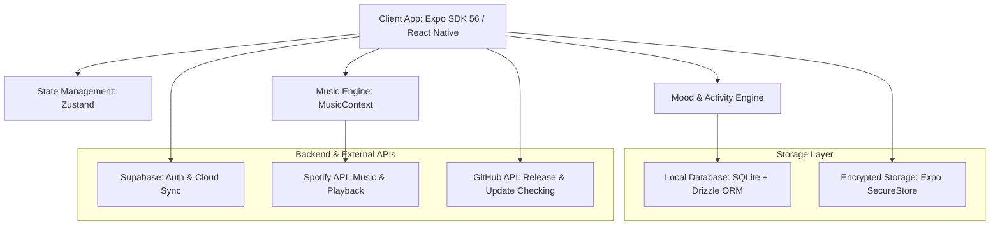

<div align="center">

# MooDMap

**Personalized Mood Tracking & Wellness Application**

[](https://github.com/as5104/MooDMap/releases/latest)
[](LICENSE)
[](https://expo.dev)
[](https://reactnative.dev)
[](https://www.typescriptlang.org)
[](https://supabase.com)
[](https://developer.spotify.com)

<p align="center">
  <a href="https://github.com/as5104/MooDMap/releases/latest"><strong>📥 Download Latest APK</strong></a> •
  <a href="https://github.com/as5104/MooDMap/releases"><strong>🚀 Release Notes</strong></a> •
  <a href="#architecture"><strong>🏗️ Architecture</strong></a> •
  <a href="#quick-start"><strong>💻 Quick Start</strong></a>
</p>

</div>

---

## 🌟 Overview

**MooDMap** is an offline-first mobile application built with React Native and Expo SDK 56 designed to help users track their daily emotional well-being, build mindfulness habits, and engage in targeted cheer-up activities.

The app places **primary focus on mood tracking, reflection journaling, and wellness exercises**, while offering integrated music playback and recommendations as an evolving companion feature to enhance emotional states.

---

## ✨ Primary Features

### 📊 1. Daily Mood Tracking & Analytics

* **Comprehensive Mood Logging**: Record daily mood types (`happy`, `calm`, `focused`, `peaceful`, `sad`, `tired`, `anxious`, `angry`, `stressed`, `motivated`), score (1-10), energy level, stress level, sleep quality, tags, and personal notes.
* **Analytics & Insights**: Track weekly mood trends, streak counters (mood & journal streaks), total XP, and level progression.
* **Visual History**: View past mood entries with color-coded badges and trend charts.

### 🧘 2. Wellness Activities & Cheer-Up Exercises

* **Targeted Recommendations**: Suggests specific wellness activities based on logged mood states:

  * **Breathing Exercises**: Deep breathing timer for stress relief.
  * **Reflection Prompts**: Guided self-reflection questions.
  * **Gratitude Journaling**: Capture daily positive moments.
  * **Grounding Techniques**: Exercises for anxiety management.
  * **Pause Timer**: Mindfulness breaks during stressful moments.
  * **Rest & Productivity**: Suggestions tuned to current energy levels.

### 📝 3. Reflection Journaling

* **Rich Journaling**: Write personal reflection entries with photo attachments.
* **Flexible Views**: Toggle between list and grid layout modes.
* **Data Export & Import**: Export journal and mood data for backup.

### 🔒 4. Privacy & Authentication

* **Multi-Method Auth**: Email/password authentication and Google OAuth 2.0 via Supabase Auth, `expo-auth-session`, and `expo-web-browser`.
* **Local SQLite Database**: High-performance local storage (`expo-sqlite` + Drizzle ORM) for offline access.
* **Biometric Security**: Secure app lock (Face ID / Fingerprint) powered by `expo-local-authentication` and encrypted token storage via `expo-secure-store`.

### 🔄 5. In-App Updates & System Information

* **GitHub Release API Integration**: Queries `https://api.github.com/repos/as5104/MooDMap/releases/latest` to check for new releases.
* **Startup Update Modal**: Displays a prompt with release notes and direct APK download links when an update is published.
* **About Screen**: Dedicated system information page (`src/app/about.tsx`) showing current app version (`v1.0.0`), framework specs, and update checks.

---

## 🎵 Companion Feature: Integrated Music Listening *(In Active Development)*

MooDMap includes music playback tools designed to complement mood management:

* **Mood-Matched Playlists**: Connects logged mood states to Spotify and Deezer track recommendations.
* **Dedicated Recommendation Playlist Screen**: Full-page playlist UI (`src/app/recommended-music.tsx`) featuring search filtering, `Play All`, `Shuffle`, and custom queue auto-advance.
* **5-Layer Recommendation Algorithm**:

  * *Layer 1*: Rule-based audio attribute mapping (valence, energy, tempo).
  * *Layer 2*: SQLite play history scoring.
  * *Layer 3*: Onboarding survey genre/artist preference matching.
  * *Layer 4*: Spotify related artist discovery.
  * *Layer 5*: User Spotify playlist mining.
* **Continuous Playback**: Appends non-repeating track batches as playback nears queue end, learning from full listens vs early skips.

---

<a id="architecture"></a>

## 🏗️ System Architecture



---

## 🛠️ Tech Stack

| Component            | Technology                       | Usage                                |
| -------------------- | -------------------------------- | ------------------------------------ |
| **Core Framework**   | React Native / Expo SDK 56       | Cross-platform runtime               |
| **Router**           | Expo Router                      | File-based navigation                |
| **State Management** | Zustand                          | Application state & streak tracking  |
| **Local DB**         | SQLite + Drizzle ORM             | Offline mood & journal data storage  |
| **Cloud & Auth**     | Supabase Auth + Google OAuth 2.0 | Authentication & cloud backup        |
| **Audio Services**   | Spotify Web API + Deezer API     | Companion music streaming            |
| **Styling**          | Glassmorphic System + Reanimated | Custom vector UI & smooth animations |
| **Type System**      | TypeScript (Strict Mode)         | Static type safety                   |

---

## 📁 Project Structure

```text
MooDMap/
├── assets/                    # App icons, splash screens, and vector artwork
├── src/
│   ├── app/                   # Expo Router navigation routes
│   │   ├── (auth)/            # Login, signup, password reset
│   │   ├── (tabs)/            # Primary tabs: Home, Journal, Insights, Music, Profile
│   │   ├── about.tsx          # System information & manual update check
│   │   ├── recommended-music.tsx # Dedicated recommendation playlist page
│   │   └── _layout.tsx        # Root provider layout & update modal
│   ├── components/
│   │   ├── music/             # Player controls, track lists, mini-player
│   │   └── ui/                # GlassCard, Button, Input, CustomAlert, UpdateModal
│   ├── constants/             # Color palettes, typography, mood definitions
│   ├── context/               # MusicContext (Playback queue & auto-advance)
│   ├── db/                    # SQLite schemas and Drizzle ORM client
│   ├── hooks/                 # Custom hooks (useSpotify, useColorScheme)
│   ├── lib/                   # Supabase client & Google OAuth helpers
│   ├── services/              # Mood Service, Journal Service, Update Service, Recommendation Engine
│   └── stores/                # Zustand stores (appStore, tierStore, alertStore)
├── app.json                   # Expo manifest configuration
├── package.json               # Dependencies and scripts
└── tsconfig.json              # TypeScript configuration
```

---

<a id="quick-start"></a>

## 💻 Getting Started

### 1. Prerequisites

* **Node.js**: `v18.0.0` or higher
* **Expo CLI**: `npx expo`
* **Mobile Device**: Expo Go app or Android Studio emulator

### 2. Installation

```bash
git clone https://github.com/as5104/MooDMap.git
cd MooDMap
npm install
```

### 3. Environment Setup

Create a `.env` file in the root directory:

```env
EXPO_PUBLIC_SUPABASE_URL=https://your-supabase-project.supabase.co
EXPO_PUBLIC_SUPABASE_ANON_KEY=your-supabase-anon-key
EXPO_PUBLIC_SPOTIFY_CLIENT_ID=your-spotify-client-id
```

### 4. Run Development Server

```bash
npx expo start
```

---

## 📦 Building the APK (Android Release)

### Cloud Build via EAS (Recommended)

```bash
npm install -g eas-cli
eas login
eas build -p android --profile preview
```

### Local Release Build

```bash
npx expo run:android --variant release
```

---

## 🔗 Key Implementation Files

* 📊 **Mood & Journal Services**: [`src/services/moodService.ts`](src/services/moodService.ts) & [`src/services/journalService.ts`](src/services/journalService.ts)
* 🔑 **Auth & Google OAuth**: [`src/lib/auth.ts`](src/lib/auth.ts)
* 🔄 **App Update Service**: [`src/services/updateService.ts`](src/services/updateService.ts)
* ℹ️ **About & Version Check**: [`src/app/about.tsx`](src/app/about.tsx)
* 🎶 **Music Recommendation Engine**: [`src/services/recommendationEngine.ts`](src/services/recommendationEngine.ts)

---

## 📄 License

Distributed under the **MIT License**. See [`LICENSE`](LICENSE) for details.

Developed by **Ankit Sarkar** ([@as5104](https://github.com/as5104)).
